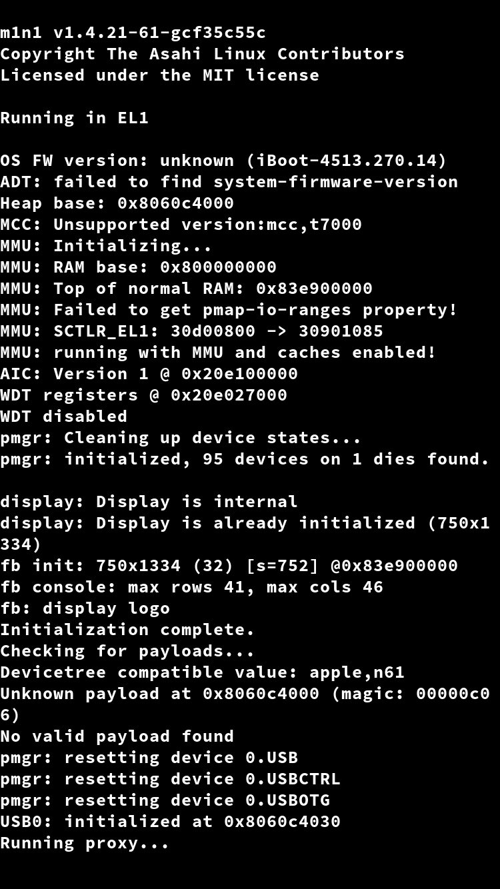
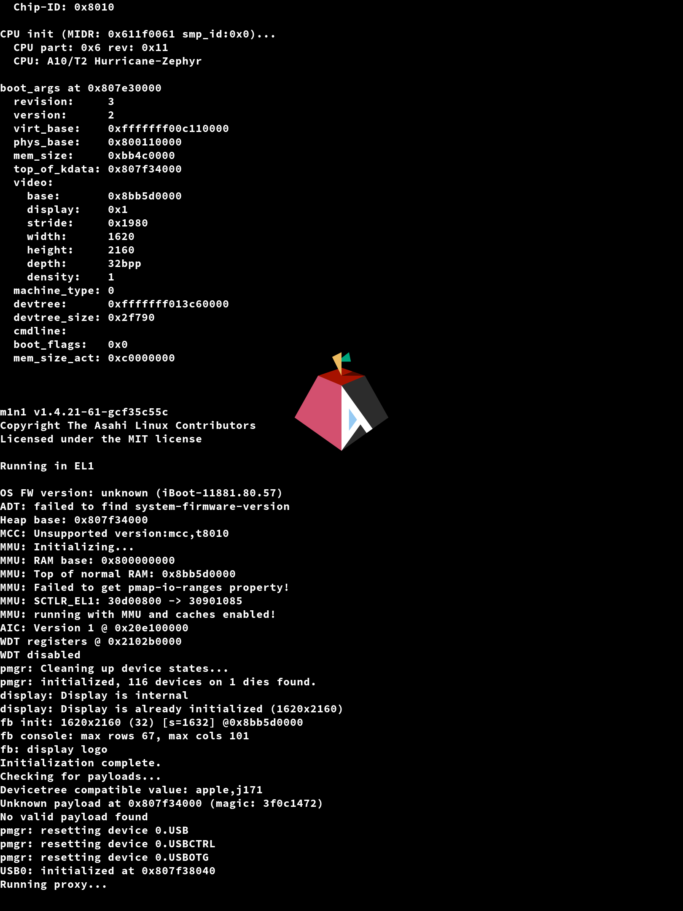
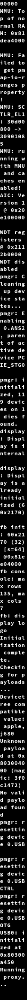

# m1n1 Framebuffer Dumps

## iPhone/iPod touch

Text occupies the entire screen, and logo will have scrolled off the screen.

## iPad

The logo remains on screen, but will still scroll afterwards.

## iPhone X

On iPhone X, the text and logo is much smaller. Logo will scroll afterwards but needs a lot more text for that to happen.

## Apple TV

Text will only be on the left side of the screen, with margins, logo does not scroll (like on Mac).

## iBridge T2

Text fills up the whole screen and is oriented "sideways", as the framebuffer is "sideways".
T2 iBridges without a touchbar does not have a screen.

